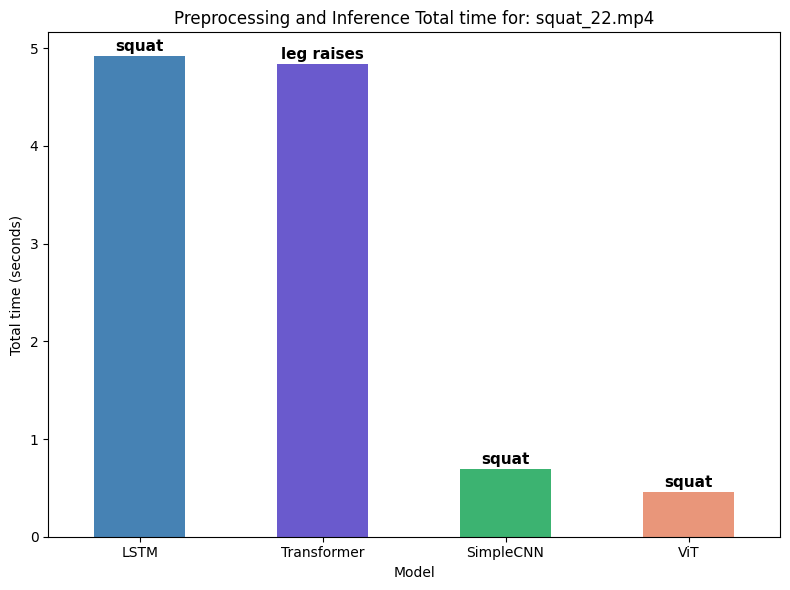
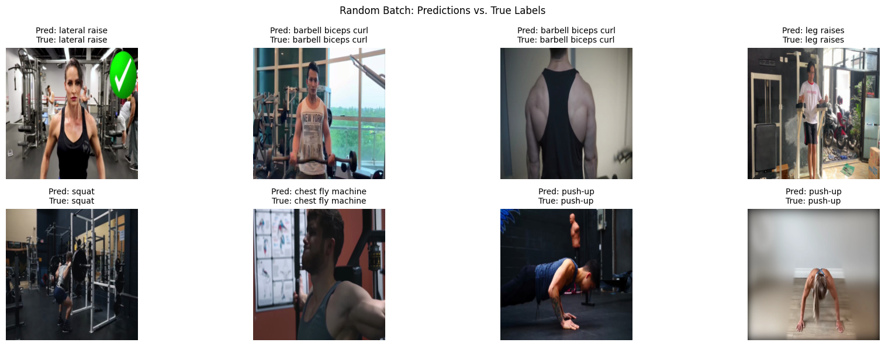

# Workout Classifier 🏋️‍♀️

## Introduction

This project demonstrates the process of building a deep-learning system capable of recognizing **22 different gym exercises** from short video clips. The notebook provides a step-by-step walkthrough of the entire process, from data acquisition to model training and evaluation.

<<<<<<< HEAD
---

## Example Outputs

### 1. Preprocessing & Inference Time Comparison

The chart below compares the **total time (in seconds)** taken by different model architectures for both preprocessing and inference on a sample video (`squat_22.mp4`).  
You can clearly see the efficiency differences across LSTM, Transformer, SimpleCNN, and ViT models.

---

### 2. Random Batch: Model Predictions vs. True Labels

Here are sample frames from a random batch, showing the **predicted vs. true labels** for various gym exercises.  
The results illustrate the model’s ability to correctly classify diverse exercise types.

---

## What You'll Find in the Notebook

1. **Dataset Download & Quick Tour**:
    - Instructions on how to obtain the [*Workout Fitness Video* dataset from Kaggle](https://www.kaggle.com/datasets/hasyimabdillah/workoutfitness-video).
    - Initial inspection of the dataset, including class balance, video clip length, and example frames.

2. **Two Preprocessing Pipelines & Model Architectures**:
    - **Frame-based Approach**:
        - Extraction of RGB frames from video clips.
        - Training of image classification models:
            - A lightweight Convolutional Neural Network (CNN).
            - A fine-tuned Vision Transformer (ViT-B/16).
    - **Pose-based Approach**:
        - Extraction of **3-D body landmarks** using MediaPipe Pose.
        - Appending per-joint velocities and confidence scores to the landmark data.
        - Feeding these sequences to custom **Multi-Stream models**:
            - ConvLSTM (Convolutional Long Short-Term Memory).
            - Transformer.

---
=======
## What You'll Find in the Notebook

1.  **Dataset Download & Quick Tour**:
    * Instructions on how to obtain the [*Workout Fitness Video* dataset from Kaggle](https://www.kaggle.com/datasets/hasyimabdillah/workoutfitness-video).
    * Initial inspection of the dataset, including class balance, video clip length, and example frames.

2.  **Two Preprocessing Pipelines & Model Architectures**:
    * **Frame-based Approach**:
        * Extraction of RGB frames from video clips.
        * Training of image classification models:
            * A lightweight Convolutional Neural Network (CNN).
            * A fine-tuned Vision Transformer (ViT-B/16).
    * **Pose-based Approach**:
        * Extraction of **3-D body landmarks** using MediaPipe Pose.
        * Appending per-joint velocities and confidence scores to the landmark data.
        * Feeding these sequences to custom **Multi-Stream models**:
            * ConvLSTM (Convolutional Long Short-Term Memory).
            * Transformer.
>>>>>>> d5115d548bb54a51a51af748b28ba30cb0ac986b

## Resources Mentioned

The notebook references several resources for further reading and understanding:
<<<<<<< HEAD

1. [Introduction to Video Classification and Human Activity Recognition (LearnOpenCV)](https://learnopencv.com/introduction-to-video-classification-and-human-activity-recognition/)
2. [Master Video Classification with Transformers (Medium)](https://medium.com/@iitkarthik/master-video-classification-with-transformers-train-a-hybrid-transformer-classifier-ce654e52cfc8)
3. [Exercise_Recognition_AI (GitHub)](https://github.com/chrisprasanna/Exercise_Recognition_AI/blob/main/ExerciseDecoder.ipynb)
4. [Flower Image Classification using Vision Transformer (Medium)](https://medium.com/@sanjay_dutta/flower-image-classification-using-vision-transformer-vit-50b71694cda3)
5. [Workout Video Classifier using CNN-LSTM model (Kaggle)](https://www.kaggle.com/code/ezerelbaz/workout-video-classifier-usinng-cnn-lstm-model)

---
=======
1.  [Introduction to Video Classification and Human Activity Recognition (LearnOpenCV)](https://learnopencv.com/introduction-to-video-classification-and-human-activity-recognition/)
2.  [Master Video Classification with Transformers (Medium)](https://medium.com/@iitkarthik/master-video-classification-with-transformers-train-a-hybrid-transformer-classifier-ce654e52cfc8)
3.  [Exercise\_Recognition\_AI (GitHub)](https://github.com/chrisprasanna/Exercise_Recognition_AI/blob/main/ExerciseDecoder.ipynb)
4.  [Flower Image Classification using Vision Transformer (Medium)](https://medium.com/@sanjay_dutta/flower-image-classification-using-vision-transformer-vit-50b71694cda3)
5.  [Workout Video Classifier using CNN-LSTM model (Kaggle)](https://www.kaggle.com/code/ezerelbaz/workout-video-classifier-usinng-cnn-lstm-model)

>>>>>>> d5115d548bb54a51a51af748b28ba30cb0ac986b
